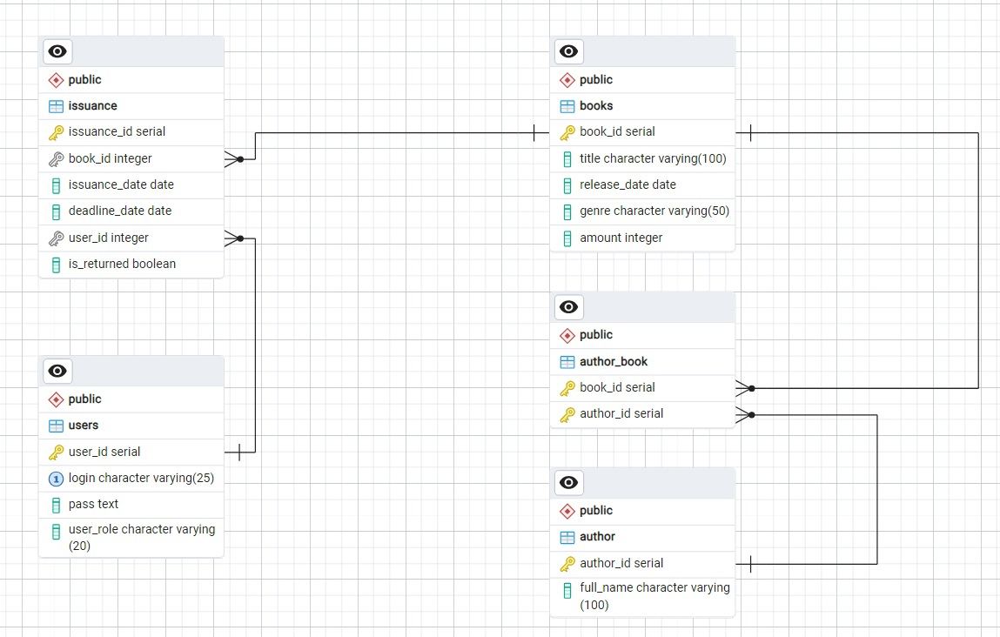

# Описание

## Наименование

BookLib – это онлайн-сервис для библиотек, предлагающий удобный способ регистрации и авторизации для пользователей, поиск книг по названию и автору, а также возможность бронирования произведений на определённый срок.

## Предметная область

Основной целью сервиса является предоставление платформы для библиотек для бронирования книг пользователями на некоторый срок. Пользователю необходимо зарегестрироваться, выбрать книги и срок для бронирования. Все книги, забронированные пользователем так же будут отображаться в личном кабинете пользователя.

# Данные

### Пользователь
+ user_id (serial, PK) - идентификатор пользователя
+ login (char varying 25) - логин пользователя
+ pass (text) - пароль пользователя
+ user_role(char varying 20) - роль пользователя

### Заказы
+ issuance_id (serial, PK) - идентификатор заказа
+ book_id (int, FK) - идентификатор книги
+ issuance_date (date) - дата начала бронировани
+ deadline_date (date) - дата конца бронирования
+ user_id (int, FK) - идентификатор пользователя
+ is_returned (bool) - состояния бронирования

### Книги
+ book_id (serial, FK) - идентификатор книги
+ title (char varying 100) - название книги
+ release_date (date) - дата выхода
+ genre (char varying 50) - жанр книги
+ amount (int) - количество в наличии

### Авторы книг
+ book_id (serial, PK, FK) - идентификатор книги
+ author_id (serial, PK, FK) - идентификатор автора

### Авторы
+ author_id (serial, PK) - идентификатор автора
+ full_name (char varying 100) - имя автора

## Пользовательские роли
+ user - пользователь после регистрации, может просматривать книги, бронировать, просматривать личный кабинет
+ adm - может удалять пользователей, добавлять книги
+ superadm - может добавлять и удалять администраторов

# UI / API

## UI:
+ Страница со всеми доступными книгами и фильтрацией по автору и/или названию книги
+ Личный кабинет пользователя с забронированными книгами
+ Окно регистрации
+ Окно входа
+ Окно бронирования книги

## API:
+ Фильтрация книг по имени и автору
+ Регистрация пользователя
+ Авторизация пользователя
+ Оформление бронирования
+ Отображение забронированных книг пользователем
+ Отмена бронирования
+ Информация о пользователе

# Технологии разработки

## Язык программирования
+ Python (fastAPI, psycopg2, uvicorn, argon2)
+ JavaScript (React, react-toastify, react-router-dom)

## СУБД
+ postgreSQL
+ pgAdmin 4

